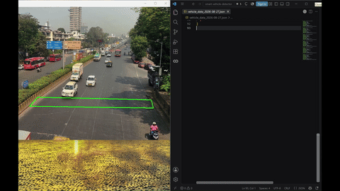

# 🚗 AutoSense - Smart Vehicle Detector

AutoSense combines real-time vehicle detection using YOLOv12 with intelligent analysis powered by a Vision Language Model (VLM) such as gemini-3.5-flash-lite. The system detects vehicles in a video stream and identifies their type, color and manufacturer, with improved accuracy from automatically estimating the country.

---

## 🎥 Demo

> Below is a quick demo of the system in action:



---

## 🚀 Features

- Real-time detection of cars, trucks, buses, motorcycles, and bicycles using YOLO.
- Persistent object tracking with unique track IDs.
- Automatic vehicle cropping from the original, clean frame.
- Gemini 3.5 Flash Lite analysis to extract:
  - Vehicle type (for example, car, bus, or truck)
  - Dominant color (for example, red, black, or white)
  - Manufacturer (for example, Toyota, BMW, or Ford)
- Initial country detection from the first frame to adapt vehicle analysis to its geographical context.
- Clean, structured JSON output for all results.

---

## ⚙️ Installation

```bash
git clone https://github.com/XDut/AutoSense.git
cd AutoSense
python smart_detector.py
```
